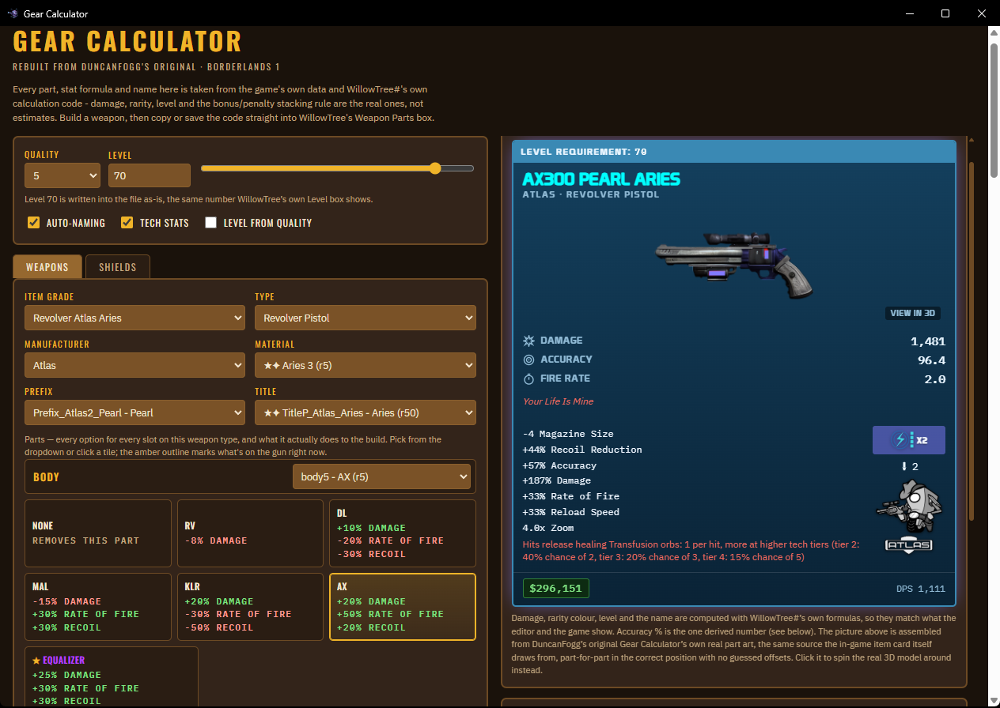
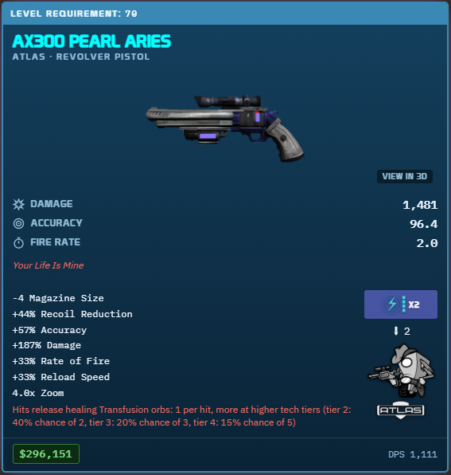
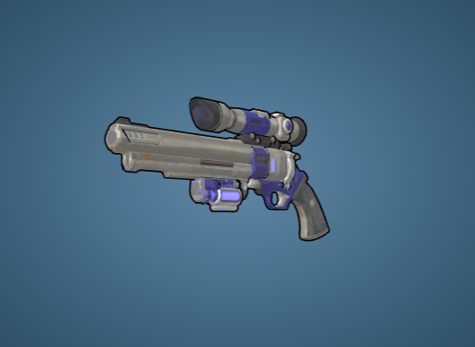
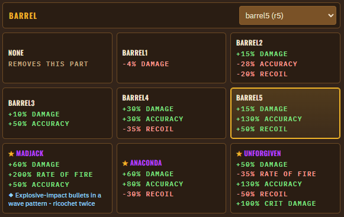

# Gear Calculator

A free, unofficial fan tool for **Borderlands 1**. Build any weapon or shield from its real parts and see the
in-game item card, the stats, a 2D and 3D picture, and a WillowTree#-style item code you can paste into your
save editor.

> Not affiliated with or endorsed by Gearbox Software or 2K.

  

  
  
  

## TL;DR

- Download `GearCalculator.exe` from **Releases** (right side of this page) → double-click it → click **Continue** on the credits screen → build.
- This is an unsigned independent Windows app, so SmartScreen may show an "Unknown Publisher" warning the first time — click **More info → Run anyway**.
- Want the code instead of just the app? See [gear-calculator-source](https://github.com/L0VE-HATE/gear-calculator-source).

## Download

Grab **GearCalculator.exe** from the **Releases** section of this repository (right-hand side of this page)
and double-click it. The first launch unpacks itself once (a few seconds); every launch after that opens
almost instantly. Nothing is installed and nothing needs the game or an internet connection.

This is an unsigned independent Windows app, so SmartScreen may show an "Unknown Publisher" warning the first
time you run it — choose **More info → Run anyway**.

A credits screen shows once each time you open the app; click Continue to get to the calculator.

## Updating to a new version

There's no auto-update - when a new version comes out, download the new `GearCalculator.exe` from Releases
and use it in place of the old one (same folder is fine, or wherever you like). Two things are expected and
not a sign anything's wrong:

- **The SmartScreen warning may show up again**, even if you dismissed it for a previous version. Windows
  treats each new exe file as unrecognized until enough people have run it, regardless of whether you ran an
  earlier version before. Same fix: **More info → Run anyway**.
- **The first launch of the new version takes a few seconds again** (the "first launch unpacks itself" step
  above) - that happens once per version, not just once ever. The app cleans up the old version's unpacked
  files automatically.

## Known issues

- **2D card color placement:** most weapons' 3D models match the real look closely; the 2D card's colors are
  usually right but not always mapped to the correct part of the gun - a skin's two colors can end up swapped
  between parts. Not yet fixed. More known issues are tracked in the source repo's README.

## Source code

This repo is just the ready-to-run app. The full source code, build scripts, and detailed credits are at:
**https://github.com/L0VE-HATE/gear-calculator-source**

## Credits

Built on DuncanFogg's original 2010 Gear Calculator, WillowTree#'s weapon parts database, the Borderlands 1
Modding wiki, and the Borderlands Fandom wiki. Full credits and licensing are in the source repository above.
Borderlands, its names, art and data belong to Gearbox Software / 2K.
